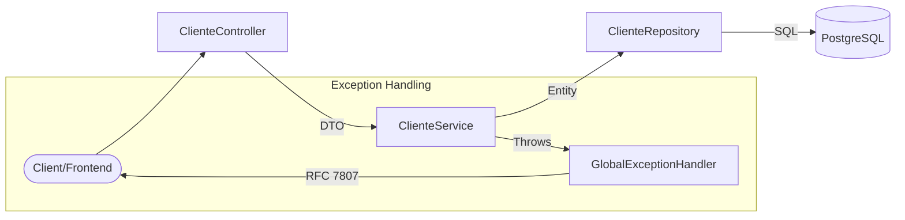

# Clientes API 🚀

[](https://www.oracle.com/java/)
[](https://spring.io/projects/spring-boot)
[](https://www.postgresql.org/)
[](https://www.docker.com/)

API REST de alta performance para gerenciamento de clientes, desenvolvida com foco em **Clean Code**, **S.O.L.I.D.** e **Arquitetura de Produção**. Este projeto foi auditado e refatorado para atingir padrões de engenharia sênior.

---

## 🏛️ Arquitetura e Design de Software

O projeto segue uma arquitetura em camadas bem definida, garantindo o desacoplamento e a testabilidade do sistema.

### 🔄 Fluxo de Dados (Mermaid)



### 🧠 Destaques Técnicos

| Característica | Implementação |
| :--- | :--- |
| **Encapsulamento** | Uso rigoroso de **DTOs** (Request/Response) para evitar exposição de entidades JPA. |
| **Tratamento de Erros** | Implementação de **RFC 7807 (Problem Details)** com `@RestControllerAdvice`. |
| **Integridade de Dados** | Validação avançada com **Bean Validation** (Regex, Size, Constraints). |
| **Persistência** | Transações gerenciadas com `@Transactional` e PostgreSQL 16. |
| **Infraestrutura** | **Docker Multi-stage Build** com imagem final baseada em JRE-Alpine (leve e segura). |

---

## 🐳 Infraestrutura e DevOps

### Docker Multi-stage
O projeto utiliza um `Dockerfile` otimizado:
1. **Builder Stage**: Compila o código dentro de um ambiente isolado.
2. **Runner Stage**: Executa a aplicação usando um **JRE leve**, rodando com **usuário não-root** para máxima segurança.

### Resiliência
O `docker-compose.yml` inclui **Healthchecks**, garantindo que a aplicação Spring só inicie após o banco de dados estar pronto para conexões.

---

## 🚀 Como Executar

### Pré-requisitos
- Docker e Docker Compose instalados.

### 1. Configurar Variáveis de Ambiente
Crie um arquivo `.env` na raiz do projeto (ou copie do `.env.example`):
```bash
cp .env.example .env
```

### 2. Subir o Ecossistema
```bash
docker compose up --build
```
A API estará disponível em `http://localhost:8080/api/clientes`.

---

## 📬 Endpoints Principais

- `GET /api/clientes` - Listagem completa (Retorna `ClienteResponse`).
- `POST /api/clientes` - Cadastro (Validação via `ClienteRequest`).
- `GET /api/clientes/{id}` - Busca detalhada (Lança `404` se inexistente).
- `GET /actuator/health` - Status de saúde da aplicação e banco.

---

## 🧪 Qualidade de Código

- **SOLID**: Princípios aplicados para garantir que cada classe tenha uma única responsabilidade.
- **Mappers**: Conversão entre entidades e DTOs centralizada em componentes `@Component`.
- **Clean Code**: Nomenclatura semântica e métodos curtos e expressivos.

---

## 👨‍💻 Autor

**Everton Rodrigues Pinheiro**  
Desenvolvido como demonstração de padrões de engenharia de software de alto nível.

---
<p align="center">
  Refatorado com o suporte do <b>everton-ai-agent-kit</b>.
</p>

