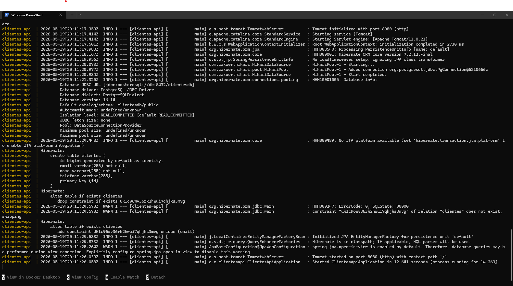

# 🚀 Clientes API

API REST para gerenciamento de clientes desenvolvida com **Java 17**, **Spring Boot**, **PostgreSQL** e **Docker**.

Este projeto demonstra conhecimentos práticos em desenvolvimento backend, arquitetura em camadas, APIs REST, persistência de dados, containerização e documentação técnica.

---

## 📌 Tecnologias Utilizadas

- Java 17
- Spring Boot
- Spring Web
- Spring Data JPA
- PostgreSQL
- Docker
- Docker Compose
- Maven
- Lombok
- Bean Validation
- Git e GitHub
- Postman

---

## ✨ Funcionalidades

- Cadastro de clientes
- Listagem de clientes
- Busca de cliente por ID
- Atualização de dados
- Exclusão de clientes
- Validação de campos obrigatórios
- Restrição de e-mail único
- Persistência em PostgreSQL
- Execução com Docker Compose

---

## 📂 Estrutura do Projeto

```text
clientes-api
├── images
│   ├── postman-create-client.png
│   └── docker-compose-running.png
├── src/main/java/com/everton/clientesapi
│   ├── controller
│   ├── dto
│   ├── model
│   ├── repository
│   └── service
├── src/main/resources
│   └── application.properties
├── Dockerfile
├── docker-compose.yml
├── pom.xml
└── README.md
```

---

## ▶️ Como Executar

### Pré-requisitos

- Java 17+
- Maven 3.9+
- Docker Desktop

### 1. Clonar o repositório

```bash
git clone https://github.com/evertonrpinheiro/clientes-api.git
cd clientes-api
```

### 2. Gerar o arquivo `.jar`

```bash
mvn clean package -DskipTests
```

### 3. Subir a aplicação e o banco

```bash
docker compose up --build
```

### 4. Acessar a API

```text
http://localhost:8080/api/clientes
```

---

## 📬 Endpoints

| Método | Endpoint | Descrição |
|--------|----------|-----------|
| POST   | `/api/clientes`      | Cadastrar cliente |
| GET    | `/api/clientes`      | Listar todos os clientes |
| GET    | `/api/clientes/{id}` | Buscar cliente por ID |
| PUT    | `/api/clientes/{id}` | Atualizar cliente |
| DELETE | `/api/clientes/{id}` | Excluir cliente |

---

## 📝 Exemplo de Requisição

### POST `/api/clientes`

```json
{
  "nome": "Everton Rodrigues Pinheiro",
  "email": "everton1857@gmail.com",
  "telefone": "44999999999"
}
```

### Exemplo de Resposta

```json
{
  "id": 1,
  "nome": "Everton Rodrigues Pinheiro",
  "email": "everton1857@gmail.com",
  "telefone": "44999999999"
}
```

---

## 📸 Demonstração

### Consulta de Clientes via Postman

> Salve a imagem em: `images/postman-create-client.png`

```markdown

```

### Aplicação e Banco em Execução com Docker Compose

> Salve a imagem em: `images/docker-compose-running.png`

```markdown

```

---

## 🐳 Docker

O projeto utiliza dois containers:

- `app`: aplicação Spring Boot
- `db`: banco de dados PostgreSQL

---

## 🧠 Competências Demonstradas

- Desenvolvimento de APIs REST
- Programação Orientada a Objetos (POO)
- Arquitetura em camadas
- Spring Boot
- JPA/Hibernate
- SQL e PostgreSQL
- Docker e Docker Compose
- Validação de dados
- Git e GitHub
- Documentação técnica

---

## 🔮 Melhorias Futuras

- Tratamento global de exceções com `@ControllerAdvice`
- Testes unitários com JUnit e Mockito
- Documentação com Swagger/OpenAPI
- Pipeline CI/CD com GitHub Actions
- Deploy em nuvem (Render, Railway ou Azure)

---

## 👨‍💻 Autor

**Everton Rodrigues Pinheiro**

- LinkedIn: https://www.linkedin.com/in/evertonrpinheiro/
- GitHub: https://github.com/evertonrpinheiro
- E-mail: everton1857@gmail.com

---

## 📄 Licença

Projeto desenvolvido para fins educacionais e de portfólio.
